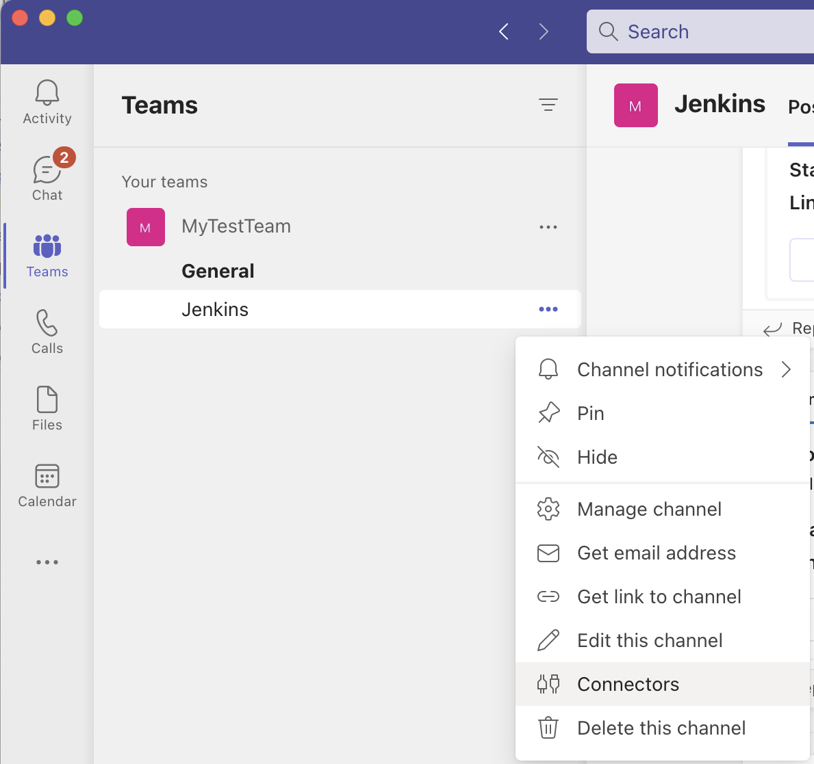
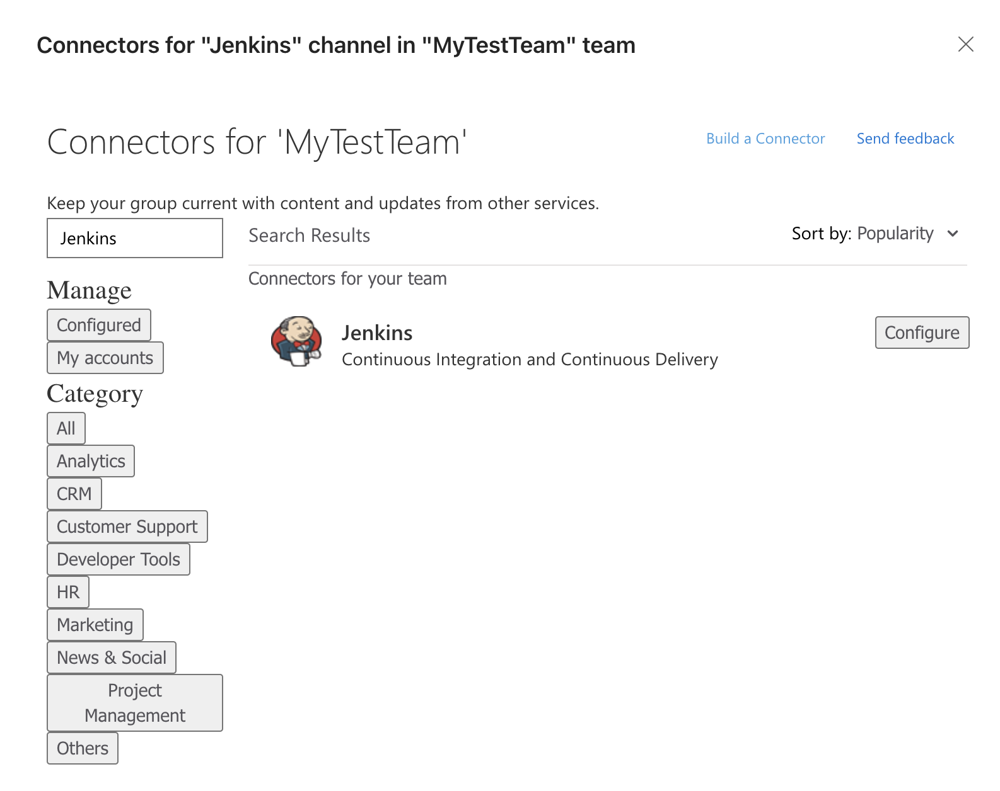
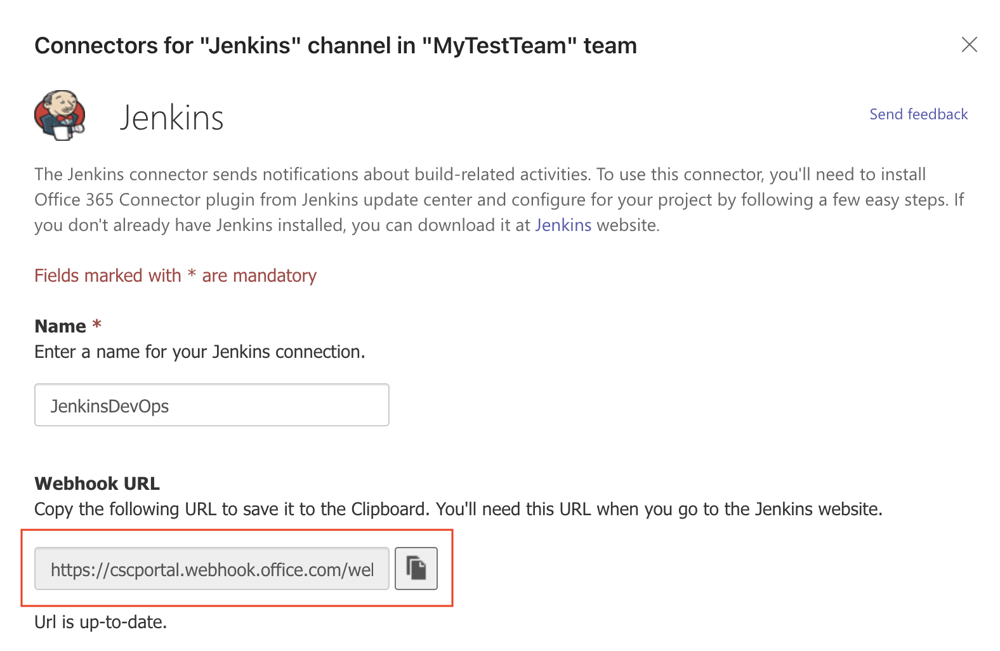
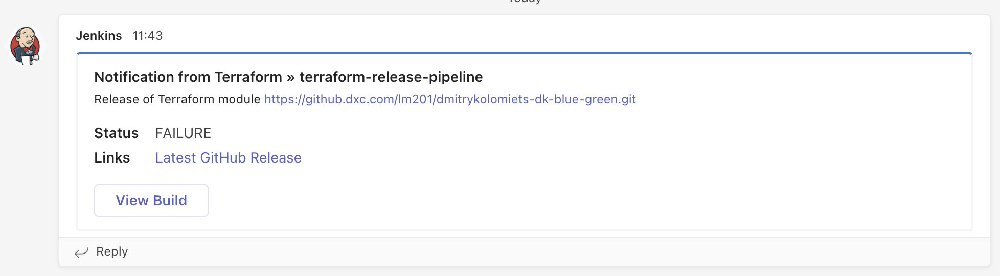

# DXC.LM.TF.Module.Template
Github template repo for future module development

## How it works

Short description of what this module does

## Job Location

Locations of the jobs to run this module

## Pre-commit checks

This repository has [pre-commit](https://github.com/antonbabenko/pre-commit-terraform) hooks configured that run checks against Terraform code. 
It is highly advisable to run the checks locally before a PR is raised as CI job will likely fail if there are any violations.

See `.pre-commit-config.yaml` for the complete list of the hooks configured.

Use the following steps to run the pre-commit checks with Docker (the most portable approach):

 - Pull pre-commit-terraform Docker image (one-time activity)
   ```
   docker pull ghcr.io/antonbabenko/pre-commit-terraform:latest
   ```
 - Run the checks:
   ```
   docker run -v $(pwd):/lint -w /lint ghcr.io/antonbabenko/pre-commit-terraform:latest run -a
   ```

## Microsoft Teams notifications
This repository contains two default Jenkinsfiles for the following pipelines:

 - `.jenkins/ci/Jenkinsfile` - **CI** pipeline triggered by a PR
 - `.jenkins/release/Jenkinsfile` - **Release** pipeline triggered by a push into `master` branch (e.g. when a PR is merged)

By default, the **Release** pipeline does not send any notifications to MS Teams, even in case of a build failure. Follow the instructions
below to enable MS Teams notifications for this repository.

### Open connectors settings for MS Teams channel


### Find Jenkins connector


### Get webhook URL


### Configure Release pipeline
One you have the webhook URL, update `.jenkins/release/Jenkinsfile` by providing `TEAMS_WEBHOOK_URL` parameter as shown below:

```
  stage('Trigger Release Creation'){
    steps {
        script {
          withCredentials ([usernamePassword(credentialsId: 'lm-jenkins-bot', usernameVariable: 'GIT_USER', passwordVariable: 'GIT_PASSWORD')]){
            build job:'Terraform/terraform-release-pipeline' , parameters:[
                string(name: "MODULE_GIT_URL", value: "${env.GIT_URL}"),
                string(name: "TEAMS_WEBHOOK_URL", value: "<webhook-url>")
              ]
          } // end with credentials
        } // end script
    } // end steps
  } // end stage
```

### Notification example



<!-- BEGINNING OF PRE-COMMIT-TERRAFORM DOCS HOOK -->
<!-- END OF PRE-COMMIT-TERRAFORM DOCS HOOK -->